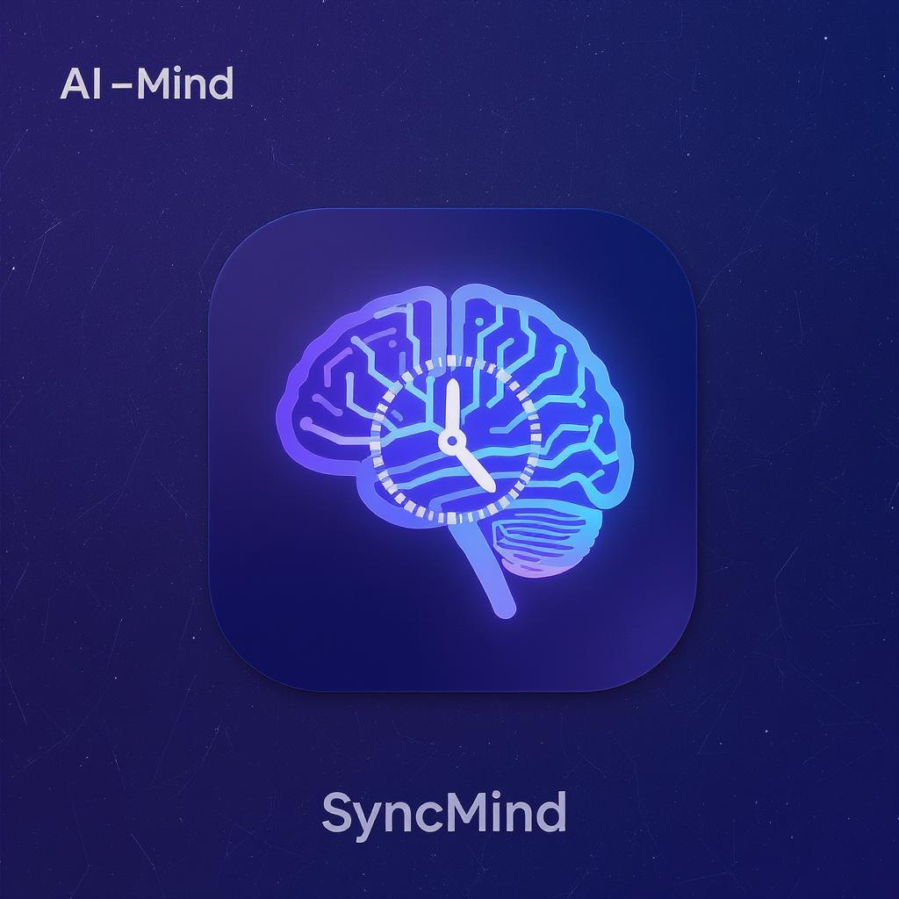
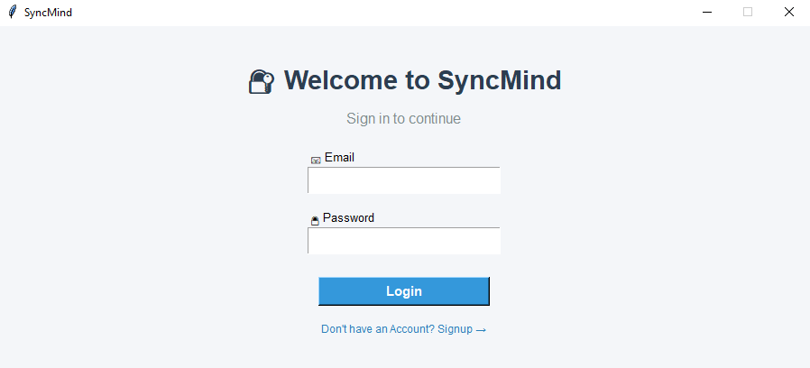
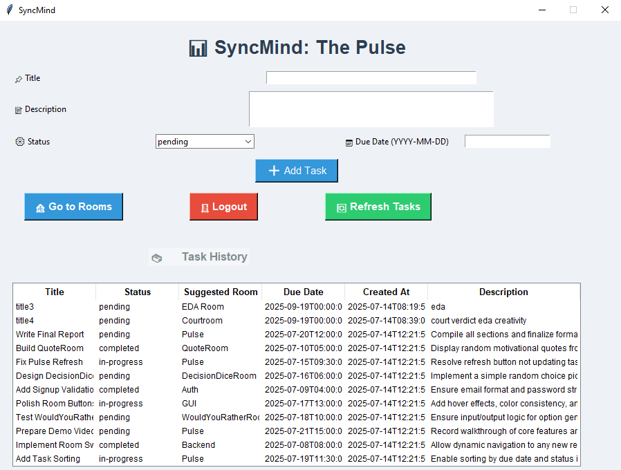
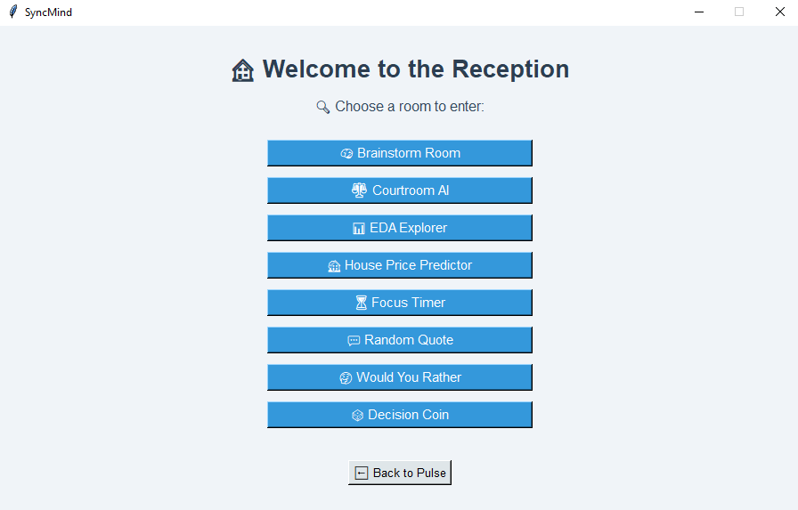
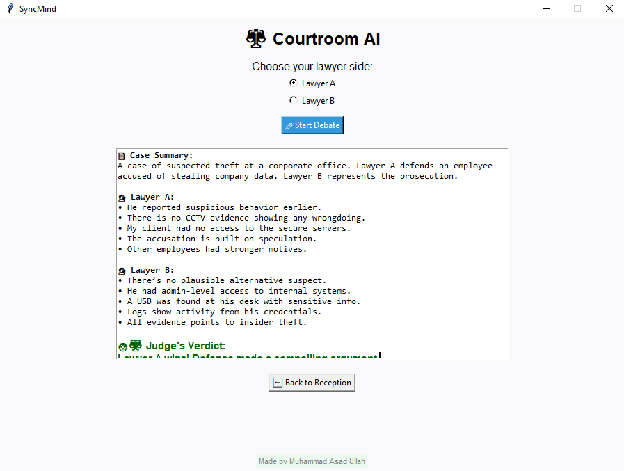
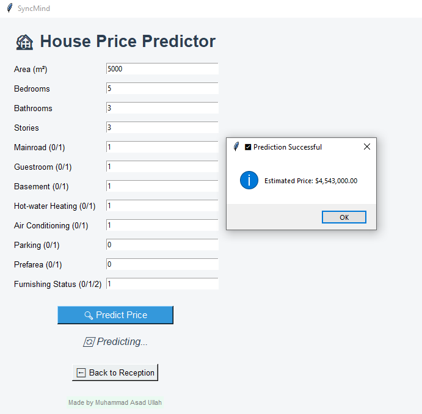

# 🧠 SyncMind

> A modular, offline-first intelligent personal productivity tool.  
> **Think better. Do smarter. All in one place.**

---

## 📌 Project Description

**SyncMind** is a personal workflow management desktop application built in **Python (Tkinter)**.  
It acts as your intelligent **solo productivity assistant**, combining features like smart task tracking, modular tools (called **Rooms**), and AI-assisted helpers — all wrapped in a fast, local-first interface.

Whether you're planning, thinking, or working — SyncMind keeps your flow, thoughts, and tasks connected and organized.

---

## ✨ Feature Summary

| Core Modules      | Description                                                                 |
|------------------|-----------------------------------------------------------------------------|
| 🧭 **The Pulse**       | Central dashboard to view your mental/task flow, history & next steps     |
| 🔄 **AutoPilot**       | Suggests what to do next based on activity –– (*Coming soon in web version*) |
| 🏛️ **Rooms**           | Themed mini-tools like Brainstorming, AI debates, Data Explorer etc.     |
| 📦 **Offline Support** | No internet required, lightweight & fast (*database excluded –– which can be swapped with SQLite/PostgreSQL for full offline use*)                                   |
| 🧩 **Modular Design**  | Easily plug in your own Room (***Full Guide Provided!***)                                       |
| 📤 **Export Ready**    | Room-specific data exports (e.g. CSVs, logs) –– (*Coming soon in web version*)                             |

---

## 🛠️ Tools & Technologies Used

| Layer             | Technology                         |
|------------------|-------------------------------------|
| Programming Lang | Python 3.x                          |
| GUI Framework    | Tkinter                             |
| Backend API      | Flask          |
| ML/EDA Tools     | Pandas, JobLib     |
| DB     | Supabase (PostgresSql)                    |
| Packaging        | PyInstaller                         |
| Others           | requests, threading, JSON, etc.     |

---


## 🧠 Philosophy: Designed for Deep Focus and Flow

SyncMind isn’t just a productivity tool — it’s a mindset system.  
Built to support creators, coders, thinkers, and dreamers who work alone but think big.

- 🔒 **Offline-First**  
  Everything can be runed locally. No cloud dependencies. Your data stays *yours* — private, portable, and persistent.

- 🧩 **Modular Architecture**  
  Add new tools (“Rooms”) without breaking the core. Customize SyncMind to match *your* workflow.

- 🛠️ **Hackable by Design**  
  Want to add a custom Python script? A mini AI model? SyncMind encourages experimentation, not limitation.

- 👤 **Solo-First Workflow**  
  Unlike team-oriented tools, SyncMind is made for **self-led productivity** — for managing *your* ideas, *your* tasks, *your* brain.

- 🧠 **Flow-Driven Navigation**  
  Switch between **Think**, **Plan**, and **Do** modes. Let the system guide you or build your own structure.

---

## 🛤️ Roadmap: From Personal Lab to Full Productivity OS

> 🚧 **Note:** This roadmap may include some planned features that are yet to be implemented in the codebase.  
> It serves as a vision guide —— some features listed below are under development or pending contribution.
 

| Status | Feature |
|--------|---------|
| ✅ | **Task Dashboard (Pulse)** — Central control for your life + work |
| ✅ | **Modular Room System** — Build or use rooms like Brainstorm, EDA, Timer, etc. |
| ✅ | **Smart Mini-AI Tools** — e.g., Courtroom AI, Decision Dice, Focus Timer |
| ✅ | **PyInstaller Packaging** — Offline .exe app with desktop icon & splash screen |
| 🔜 | **AutoPilot Engine** — Light AI to guide your next task |
| 🔜 | **Room Marketplace** — Share or import custom productivity rooms |
| 🔜 | **Cloud Sync (Opt-in)** — Secure sync across devices |
| 🔜 | **Web-Based Version** — React + FastAPI build for always-accessible flow |
| 🔜 | **Insight Dashboard** — Visual analytics on focus patterns and task history |
| 🚧 | **Library Mode** — Reuse SyncMind logic for other Python apps |

---

## 🖥️ Interface Preview

> ✨ SyncMind is fully built and ready to explore. Below are snapshots of key screens — the complete desktop app is already functional and modular.

---

### 🔐 Login Screen


- Minimal and clean login UI  
- Email/password fields with validation  
- Button to navigate to Signup page

---

### 🧭 The Pulse (Dashboard)


- Centralized task view and tracker  
- View tasks by status: Active, Completed, etc.  
- Access AutoPilot and QuickMode  
- Links to all Rooms

---

### 🏠 Reception Room


- Room selection hub  
- Navigate to themed Rooms (e.g., CourtroomAI, Timer)  
- Lightweight and designed for modular expansion

---

### ⚖️ Courtroom AI


- Type a case or dilemma and get a neutral “verdict”  
- Great for quick decisions or debates  
- Minimal UI with engaging tone

---

### 🏡 House Price Predictor


- Enter home specs (area, bedrooms, etc.)  
- Backend ML model returns predicted price  
- Neat results display with local/offline support

---

> 💡 Explore the code, run it and test the rest for yourself.

---

## 🚀 Setup & Run Instructions

### 🔧 Prerequisites

- Python 3.10+
- `pip` installed

### 📦 Installation

```bash
git clone https://github.com/your-username/SyncMind.git
cd SyncMind
pip install -r requirements.txt

# First, run the backend
cd backend
python app.py

# Then, open a second terminal and run the GUI
cd gui
python main.py
```
>✅ For offline-only usage, the backend is optional (depending on Room)

## 🧩 How to Add a New Room (Your Own Tool)

Creating a new Room is easy — just follow this template:

---

### 1. Create a Room File

Inside `gui/pages/rooms`, create a new file like `my_room.py`:

```python
import tkinter as tk

class MyRoom(tk.Frame):
    def __init__(self, parent, controller):
        super().__init__(parent)
        self.controller = controller
        tk.Label(self, text="🧪 My Custom Room").pack(pady=20)
```
> This code is a must — further functionality is added below it

### 2. Add Button to Reception
In ReceptionPage, add detailes properly to navigate to it:

```python
rooms = [
    {"name": "My Room", "page": "MyRoom"},
    ...
]
```
> Make sure *page* is the same as your *room's class name* — i.e. **Class MyRoom(tk.Frame)**

<details>
  <summary>📦 Internal Room Registry (Click to Expand)</summary>

  <br/>

  ```python
  rooms = [
      {"name": "QuoteRoom", "page": "QuoteRoom"},
      {"name": "CourtroomAI", "page": "CourtroomAI"},
      {"name": "EDA Explorer", "page": "EDAExplorer"},
      {"name": "House Price Predictor", "page": "HousePricePredictor"},
      {"name": "Focus Timer", "page": "FocusTimer"},
      {"name": "Decision Dice", "page": "DecisionDiceRoom"},
      {"name": "Would You Rather", "page": "WouldYouRatherRoom"}
  ]
```
<blockquote> 🛠️ Each room is modularly imported, registered, and routed using the <code>controller.show_frame()</code> system. </blockquote> </details>

---

## 👥 Contributor Credits

| Contributor             | Role                             | Major Contributions                                                                                             |
|-------------------------|----------------------------------|------------------------------------------------------------------------------------------------------------------|
| [**Muhammad Asad Ullah**](https://github.com/PypCoder) | Lead Engineer & Architect      | Project lead — complete backend logic, Pulse system, Rooms, GUI functionality, repo, docs, packaging |
| [**Abeeha Ali**](https://github.com/Ali21-ai)    | UI/UX Designer & Frontend Lead | Designed UI wireframes, helped style Pulse visuals, contributed idea/room: QuoteRoom                          |
| [**Subhan Malik**](https://github.com/subhan393)  | Backend Helper & Room Contributor | Helped with DB integration (Supabase), concept for WouldYouRatherRoom                                          |
| [**Ali Husnain**](https://github.com/alihussnainhafeez)      | Support Developer              | Contributed ideas for DecisionDiceRoom, assisted with minor frontend and functionality tweaks                 |


## 🧠 Vision
SyncMind is your mental operating system —
A modular, intelligent platform for personal productivity.

## 📜 License
MIT License — use, contribute, remix freely.

---

<p align="center">
  <sub><i>Crafted for clarity. Designed for flow.</i></sub>
</p>

<p align="center">
  
</p>


