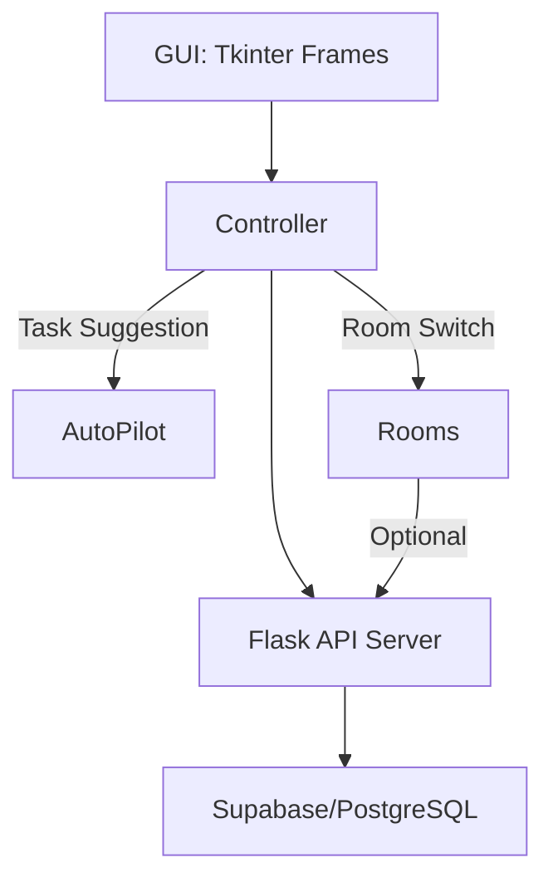

# 🧠 SyncMind Architecture

> **“Built for solo productivity, designed for modularity, powered by Python.”**

---

## 📐 High-Level Overview

SyncMind is an offline-first, Tkinter-powered personal productivity suite.  
It integrates a lightweight backend with intelligent task guidance, modular "Rooms", and a unified dashboard called **The Pulse** — all working together to deliver a powerful solo workflow environment.

| Feature        | Description                                              |
|----------------|----------------------------------------------------------|
| The Pulse      | ← Core Dashboard (task view, live feed, modes)          |
| Rooms          | ← Mini tools (Pomodoro, Quote, EDA, AI rooms, etc.)     |
| AutoPilot      | ← Smart suggestions, QuickMode engine                   |
| Local Backend  | ← Flask + Supabase/Postgres                             |


---

## 🧩 Key Components

### 1. **Frontend (Tkinter GUI)**

- **Framework**: Tkinter + ttk widgets
- **Structure**: Multi-page layout using `tk.Frame` inheritance
- **Navigation**: Frame-switching handled by a central `controller`  
- **Pages**:  
  - `LoginPage`, `SignupPage`, `ReceptionPage`, `PulsePage`  
  - Modular Rooms: `CourtroomAI`, `HousePricePredictor`, `EDAExplorer`, etc.

📁 Directory: `gui/`

```bash
gui/
├── main.py              # App entry point
├── assets/              # Icons, splash images, etc.
├── pages/               # All frames (rooms, pulse, login, etc.)
|   ├── room/ 
|        
|       ├── pulse.py
│       ├── reception.py
│       ├── quote_room.py
│       └── ...
```
### 2. Backend (Flask API)
- **Framework:** Flask

- **Data Layer:** Supabase (PostgreSQL)

- **Main API Prefix:** `/syncmind/api/`

- **APIs:**


    - /auth/login/
    - /auth/signup/
    - /pulse/get_tasks/
    - /pulse/create_task/
    - /rooms/model/predicthouseprice, etc.

📁 Directory: `backend/`
```
backend/
├── app.py                # Flask app initializer
├── api/
│   ├── auth.py           # Login/signup logic
│   ├── pulse.py          # Task CRUD
│   └── rooms/            # Specialized APIs (e.g., ML predictions)
|       ├──model/
|           └── ...
|       ├── edaexplorar.py
|       └── ...
├── supabase/
|   ├── supabase.py
│   └── schema.sql       # Supabase integration
├── docs/
|   └── architecture.md
```
> ✅ Optional:
- Local DB can be switched to SQLite/Postgres
_ Fully offline if DB is set up locally

### 3. Task System (Pulse)
- Central dashboard showing task status

- Data fetched from `/pulse/get_tasks`

- Supports:

    - Status filtering ( `pending`, `completed`, etc. )
    - Auto-refresh via "🔄 Refresh" button
    - Integration with AutoPilot (suggest next task)

### 4. AutoPilot + QuickMode Engine
- Modes: Think, Plan, Do
- Selects a task → Opens corresponding Room → Starts timer
- Future-ready to plug in AI logic or historical learning

### 5. Room Framework
- Each Room is a self-contained module
- Connected to backend if needed (e.g., HousePricePredictor)
- Created by extending `tk.Frame`
- Easy to plug and play

> **💡 Example Rooms:**

- HousePricePredictor – ML-backed price estimator
- QuoteRoom – Static quote display
- EDAExplorer – Exploratory Data Analysis
- CourtroomAI – ML-based Judement

## 🏗️ Component Interaction

## ⚙️ Data Flow
**Task Creation Example:**

1. User enters task in GUI →
2. Controller sends JSON to `/pulse/create_task` →
3. Flask validates and forwards to Supabase →
4. Task added, Pulse refreshes view

**ML Prediction Example:**
1. Room sends input JSON to `/rooms/model/predicthouseprice` →
2. Flask calls prediction script →
3. Result returned and displayed in Room

## 🔒 Offline-first Philosophy
- All business logic runs locally
- Optional cloud sync (future)
- You control your data

## 📦 Packaging & Deployment
- PyInstaller used to bundle into `.exe`
- Desktop icon: `assets/icon_image_3.ico`
- Splash screen: `gui/splash.py`

## 🧩 Adding a New Room
### See [How to Add a Room](../README.md#-how-to-add-a-new-room-your-own-tool)

## 🔄 Future Considerations
- Move to FastAPI for async boost
- Embed lightweight models for local AI
- Use SQLite for fully offline mode
- Modular plugin manager for Rooms

## 👥 Credits & Roles
| Contributor             | Role & Area                                               |
| ----------------------- | --------------------------------------------------------- |
| **Muhammad Asad Ullah** | Lead engineer (backend, Pulse, Rooms, structure, logic)   |
| **Abeeha Ali**          | GUI/UX design, wireframes, QuoteRoom styling              |
| **Subhan Malik**        | DB integration, WouldYouRatherRoom concept                |
| **Ali Husnain**         | Idea + helper for DecisionDiceRoom, minor functionalities |


- > ### SyncMind is more than code — it's a framework for focus.